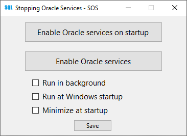

# Stopping Oracle Services - SOS
<!-- StoppingOracleServices -->
<!-- OracleServices -->
<!-- S.O.S Oracle -->
<!-- Oracle SQL Developer -->
<!-- sqldeveloper64W.exe -->
<!-- sqldeveloper64W -->
<!-- sqldeveloper64 -->
<!-- sqldeveloper -->
<!-- OracleOraDB -->
<!-- OracleServiceXE -->

**Requires .NET 6.0**

**Oracle Services - SOS** is a simple window to help users to turn off Oracle Services or even to disable them. It will reduce your computer consumption and might runs even faster.

This small program is perfect for those who run Oracle on their laptop.

### Story behind
As a programming student, I made this program because it used to drain a lot of power from my computer even when I wasn't using Oracle. One day I forgot my laptop charger at home and I ran out of batteries during my C# course.

Sorry if the code don't respect some programming principle; I started to develop it when *SOLID* was not even in my mind. The code is small tho so it's not that bad. I usually update it as soon as I find a bug or something to fix. Also everything is on the master branch since I don't know how it works 😅

### SOS settings

The SOS panel is verry simple. You can chose to:
- Enable/disable manually Oracle Services at Windows startup
- Enable/disable manually Oracle Services

Even more simple:
- Run in background
- Run *[the program]* at Windows startup
- Minimize at startup
- Don't forget to **save** 😉

### Precisions
The *"Run in background"* option turns off *"Oracle Services at Windows startup"* by default. The buttons get *gray* and a loop is searching at every 4 seconds if *sqldeveloper64W.exe* runs. **You can't disable it as long as *Oracle SQL Developer* runs!**

*"Run at Windows startup"* will add a new task to the Task Scheduler named *"StoppingOracleServices"*. That's why you need to run SOS as admin.

Have a nice one! JC
